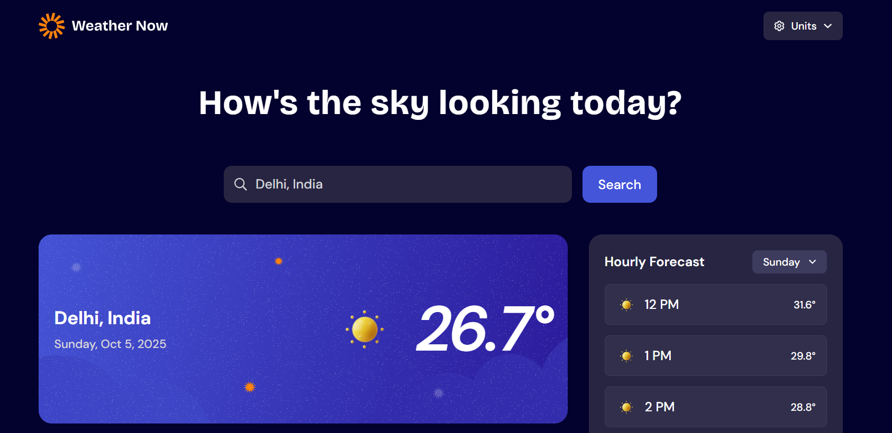

# Frontend Mentor - Weather app solution

This is a solution to the [Weather app challenge on Frontend Mentor](https://www.frontendmentor.io/challenges/weather-app-K1FhddVm49). Frontend Mentor challenges help you improve your coding skills by building realistic projects. 

## Table of contents

- [Overview](#overview)
  - [The challenge](#the-challenge)
  - [Screenshot](#screenshot)
  - [Links](#links)
- [My process](#my-process)
  - [Built with](#built-with)
  - [What I learned](#what-i-learned)
  - [Continued development](#continued-development)
  - [Useful resources](#useful-resources)
- [Author](#author)
- [Acknowledgments](#acknowledgments)

## Overview

### The challenge

Users should be able to:

- Search for weather information by entering a location in the search bar
- View current weather conditions including temperature, weather icon, and location details
- See additional weather metrics like "feels like" temperature, humidity percentage, wind speed, and precipitation amounts
- Browse a 7-day weather forecast with daily high/low temperatures and weather icons
- View an hourly forecast showing temperature changes throughout the day
- Switch between different days of the week using the day selector in the hourly forecast section
- Toggle between Imperial and Metric measurement units via the units dropdown 
- Switch between specific temperature units (Celsius and Fahrenheit) and measurement units for wind speed (km/h and mph) and precipitation (millimeters) via the units dropdown
- View the optimal layout for the interface depending on their device's screen size
- See hover and focus states for all interactive elements on the page

### Screenshot

### Links

- Solution URL: [Weather-App-FM-Hackathon](https://github.com/JeffTunner/Weather-App-FM-Hackathon)
- Live Site URL: [Weather-App-FM-JTunner](https://weather-app-fm-jtunner.netlify.app/)

## My process

### Built with

- Semantic HTML5 markup
- CSS custom properties
- Flexbox
- CSS Grid
- Mobile-first workflow
- [React](https://reactjs.org/) - JS library
- [Tailwind CSS](https://tailwindcss.com/) - React framework
- [Vite](https://vite.dev/) - For styles
- [Open Mateo API](https://open-meteo.com/)
- Dynamic React Context for global weather state

### What I learned

- During this project, I improved my skills in:
- React Context API for managing global weather data.
- Conditional rendering for loading states, fallbacks, and skeletons.
- Mapping weather codes to dynamically update weather icons.
- Handling dates and times in JavaScript for hourly and daily forecasts.
- Building a responsive design that switches backgrounds and layouts based on screen size.
- Using Tailwind CSS for modern, consistent, and responsive styling.

// Example: Dynamic weather icon based on weather code
const getWeatherIcon = (code) => {
  if (code === 0) return sunIcon;
  if (code === 2) return partlyCloudyIcon;
  if (code >= 61 && code <= 67) return rainIcon;
  return sunIcon;
};

### Continued development

- In future updates, I plan to:
- Add animated weather effects (rain, snow, storm).
- Enhance search functionality to auto-suggest cities.
- Improve UI accessibility, keyboard navigation, and focus states.

### Useful resources

- [Open-Meteo API Docs](https://open-meteo.com) - Provided weather data structure and codes.
- [Tailwind CSS Documentation](https://tailwindcss.com/docs/installation/using-vite) - Helped me implement responsive styling efficiently.
- [MDN Date API](https://developer.mozilla.org/en-US/docs/Web/JavaScript/Reference/Global_Objects/Date) - Used for formatting hourly and daily forecasts.

## Author

- Website - [Abhinav Kaushik]
- Frontend Mentor - [@JeffTunner](https://www.frontendmentor.io/profile/JeffTunner)
- X - [@OyeAbhinav](https://x.com/OyeAbhinav)

## Acknowledgments

- Thanks to Frontend Mentor for providing the challenge and inspiring realistic UI design.
- Inspired by modern weather apps for responsive and clean layouts.

